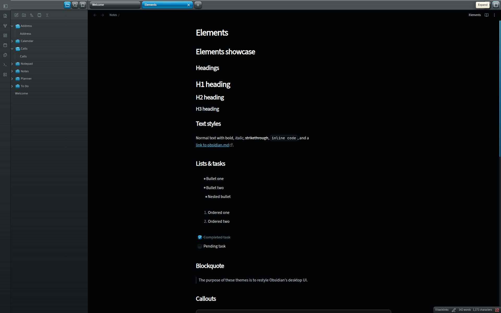
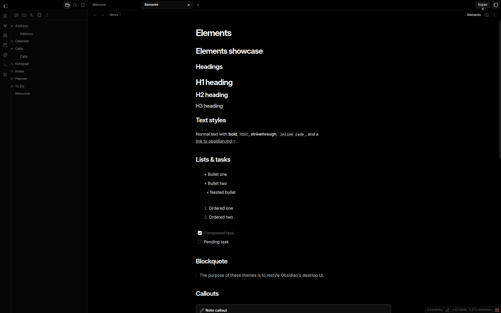
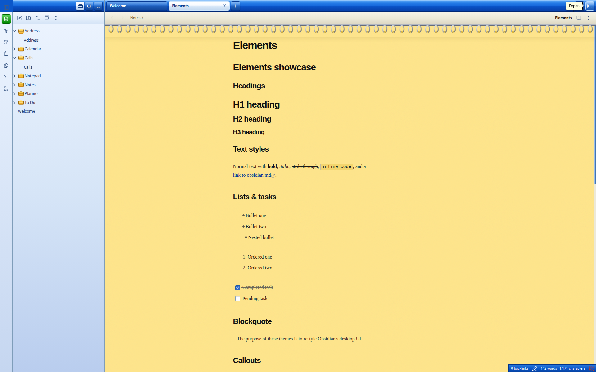
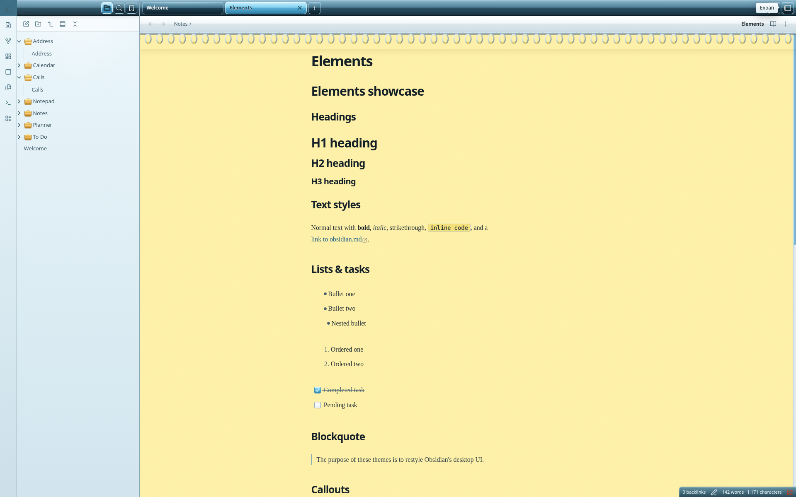
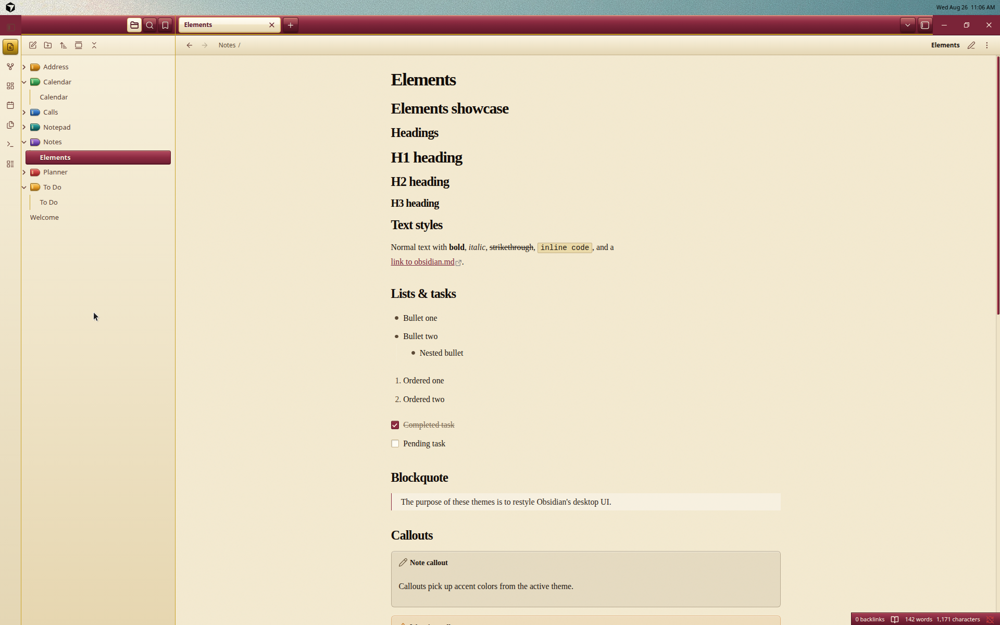
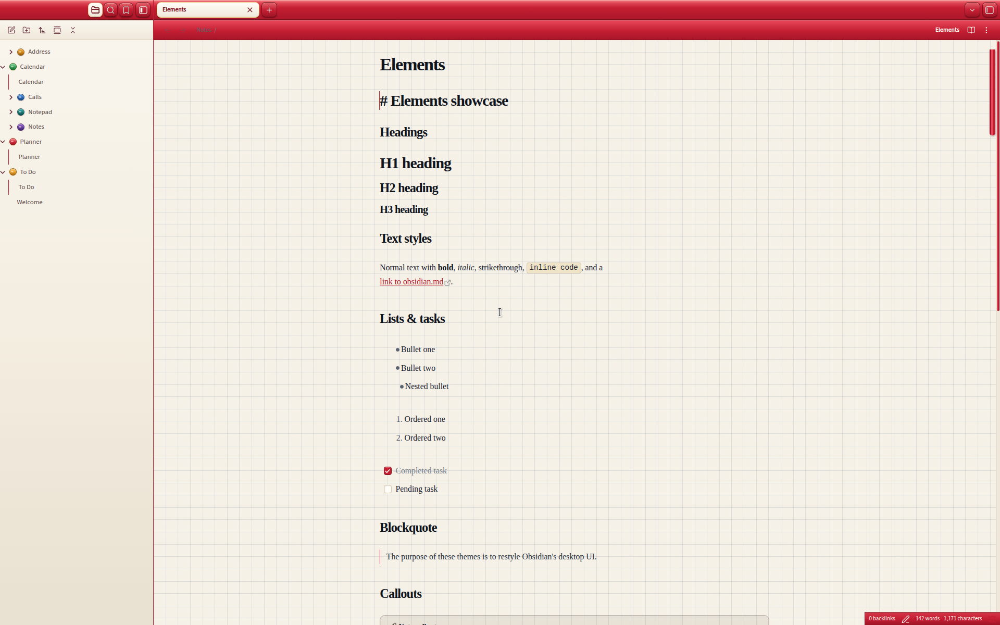
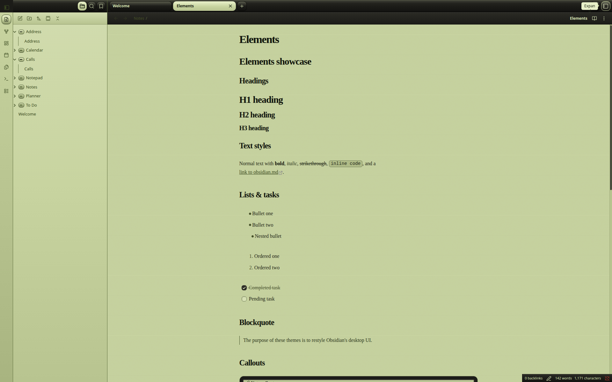
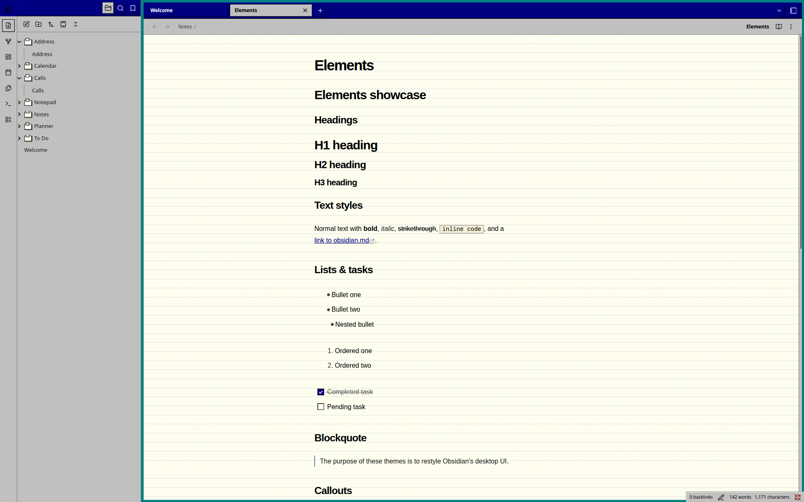
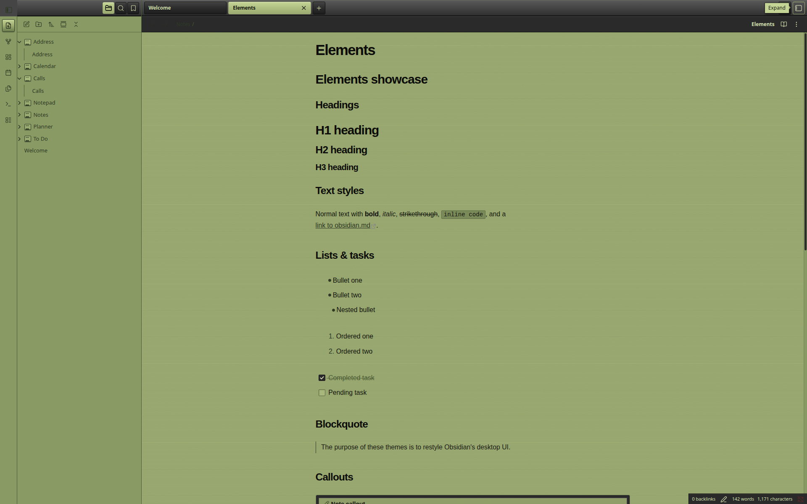

# my-obsidian-themes

Nine standalone Obsidian desktop themes, each a folder with `manifest.json` and `theme.css`:

| Folder | Palette | Client surfaces | Body guard |
| --- | --- | --- | --- |
| `Aqua 2000` | Early-2000s Aqua, graphite + glossy blue | Dark | `body.theme-dark:not(.is-mobile)` |
| `Vercel Noir` | Neutral / no chromatic UI accents | Dark | `body.theme-dark:not(.is-mobile)` |
| `Windows XP Luna` | Luna Blue chrome, yellow spiral notepad | Light in both schemes | `body:is(.theme-dark, .theme-light):not(.is-mobile)` |
| `Windows Vista Aero` | Aero glass chrome, yellow spiral notepad | Light in both schemes | `body:is(.theme-dark, .theme-light):not(.is-mobile)` |
| `Lotus Organizer` | Burgundy leather, brass rings, cream Filofax pages | Light in both schemes | `body:is(.theme-dark, .theme-light):not(.is-mobile)` |
| `Hobonichi Techo` | Candy-apple cover, cream graph paper, red bookmark | Light in both schemes | `body:is(.theme-dark, .theme-light):not(.is-mobile)` |
| `Newton MessagePad` | Black hardware, olive-green LCD, silk buttons | Light in both schemes | `body:is(.theme-dark, .theme-light):not(.is-mobile)` |
| `Windows 3.1 Cardfile` | Navy titlebar, 3D gray chrome, index cards | Light in both schemes | `body:is(.theme-dark, .theme-light):not(.is-mobile)` |
| `Palm OS Memo Pad` | Charcoal plastic, olive graffiti LCD | Light in both schemes | `body:is(.theme-dark, .theme-light):not(.is-mobile)` |

Target app version is **Obsidian 1.13.7** (`minAppVersion` in every manifest). Desktop-only by design: mobile keeps stock UI.

## Theme previews

Captured in the sample vault on Obsidian 1.13.7: left file explorer open, `Notes/Elements.md` in reading view. PNGs live in [`docs/screenshots/`](docs/screenshots/).

<table>
<tr>
<td align="center" valign="top" width="50%">
<strong>Aqua 2000</strong> 

</td>
<td align="center" valign="top" width="50%">
<strong>Vercel Noir</strong> 

</td>
</tr>
<tr>
<td align="center" valign="top" width="50%">
<strong>Windows XP Luna</strong> 

</td>
<td align="center" valign="top" width="50%">
<strong>Windows Vista Aero</strong> 

</td>
</tr>
<tr>
<td align="center" valign="top" width="50%">
<strong>Lotus Organizer</strong> 

</td>
<td align="center" valign="top" width="50%">
<strong>Hobonichi Techo</strong> 

</td>
</tr>
<tr>
<td align="center" valign="top" width="50%">
<strong>Newton MessagePad</strong> 

</td>
<td align="center" valign="top" width="50%">
<strong>Windows 3.1 Cardfile</strong> 

</td>
</tr>
<tr>
<td align="center" valign="top" width="50%">
<strong>Palm OS Memo Pad</strong> 

</td>
</tr>
</table>

**If you are adding another theme, or changing titlebar / sidebar / traffic-light geometry, read [`docs/obsidian-theme-authoring.md`](docs/obsidian-theme-authoring.md) first.** It is the field notes from shipping the shared chrome in PR #4: native DOM, `--frame-*-space` math, the ribbon-width trap, sidedock clones, new-tab flex order, and icon-token leaks.

Preview scripts live in [`.cursor/`](.cursor/). They symlink every theme folder into `~/ObsidianVault/.obsidian/themes/` so edits to repo CSS show up after a reload.

## 1990s note-taking homages

XP / Vista already own the yellow legal pad. New period themes clone **Windows XP Luna** (light notepad + saturated chrome) and pick a product whose chrome is not another cobalt titlebar.

| Homage | Why it works here | Status |
| --- | --- | --- |
| **Lotus Organizer 2.1 / 97** | Filofax-on-Windows PIM. Burgundy cover, brass rings, rainbow section tabs. | Shipped |
| **Newton MessagePad Notes** | Green LCD and black hardware bezel. Homage, not a replica silk bar. | Shipped |
| **Windows 3.1 Cardfile** | Navy title, 3D gray, stacked index cards on teal. No replica A–M letter strip. | Shipped |
| **Palm OS Memo Pad** | Olive graffiti LCD and charcoal plastic. Homage, not a replica 123 silk. | Shipped |
| **Hobonichi Techo** | Japanese daily planner. Candy-apple cover, cream graph, bookmark ribbon. | Shipped |
| HyperCard | Card stacks, Home button, System 7 chrome. | Needs stacked-tab work this repo has not restyled |
| ECCO Pro | Famous outliner, visually plain. | Skipped |
| Lotus Notes R4/R5 | Green workspace tabs. Groupware, not a personal notebook. | Skipped |
| Magic Cap | Rooms and desks. Conceptual, poor map onto Obsidian chrome. | Skipped |
